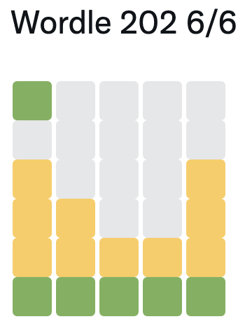

## Code for playing Wordle using network models

https://www.powerlanguage.co.uk/wordle/

### Running the code
1. Create a directory in the repo root called "network" 
2. Run scripts/build_net.R (this creates a pretty big network object, so make sure it's added to .gitignore)
3. Run play_wordle.R (this works best from RStudio as it doesn't save or plot any output).

### Acknowledgements
I have nothing to do with the game Wordle. Please give all credit to its amazing creator. 

### License
(see LICENSE)

## Additional license, warranty, and copyright information
We provide a license for our code (see LICENSE) and do not claim ownership, nor the right to license, the data we have obtained.  Please cite the appropriate agency, paper, and/or individual in publications and/or derivatives using these data, contact them regarding the legal use of these data, and remember to pass-forward any existing license/warranty/copyright information.  As a reminder, THE DATA AND SOFTWARE ARE PROVIDED "AS IS", WITHOUT WARRANTY OF ANY KIND, EXPRESS OR IMPLIED, INCLUDING BUT NOT LIMITED TO THE WARRANTIES OF MERCHANTABILITY, FITNESS FOR A PARTICULAR PURPOSE AND NON-INFRINGEMENT. IN NO EVENT SHALL THE AUTHORS OR COPYRIGHT HOLDERS BE LIABLE FOR ANY CLAIM, DAMAGES OR OTHER LIABILITY, WHETHER IN AN ACTION OF CONTRACT, TORT OR OTHERWISE, ARISING FROM, OUT OF OR IN CONNECTION WITH THE DATA AND/OR SOFTWARE OR THE USE OR OTHER DEALINGS IN THE DATA AND/OR SOFTWARE.
